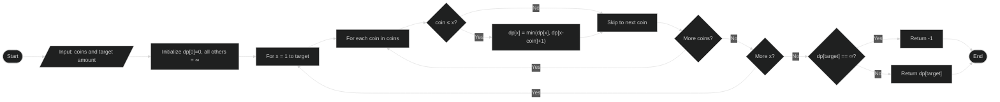

<h1 align="center" id="title">Coin-Change</h1>

<p align="center"></p>

<p id="description">This project explores the Coin Change Problem comparing
greedy algorithms and dynamic programming approaches for finding the minimum
number of coins to reach a target value. It includes proofs for greedy correctness
in canonical systems and demonstrates real-world applications
where greedy strategies succeed or fail.</p>



---

## Table of Contents
1. [Project Overview](#project-overview)
2. [Features](#features)
3. [Project Structure](#project-structure)
4. [Getting Started](#getting-started)
5. [Usage](#usage)
6. [Examples](#examples)
7. [Graphs and Datasets](#graphs-and-datasets)
8. [Real-World Applications](#real-world-applications)
9. [References](#references)

---

## Project Overview
The Coin Change Problem is a classical problem in **Dynamic Programming and Greedy algorithms**:

- **Greedy Algorithm:** Works optimally for canonical coin systems (e.g., standard currency) and finds the minimum number of coins quickly.  
- **Dynamic Programming (DP):** Guarantees minimum coins for **any set of coin denominations**, even when greedy fails.  

This project provides:
- Proof of greedy correctness for canonical coin systems.
- DP implementation for general coin denominations.
- Runtime and output comparison of greedy vs. DP.
- Real-world examples using greedy algorithm.

---

## Features
- **Proofs and correctness**: Demonstrates greedy works for canonical coins.  
- **Dynamic Programming**: Works for all coin denominations.  
- **Runtime Comparison**: Compare performance of greedy vs. DP.  
- **Real-World Simulations**:  
  - Vending Machine coin system  
  - Vault Hunter mod in Minecraft (bronze, silver, gold, platinum coins)  
- **Automated Graphs & Dataset Generation**.

---

## Project Structure

```
Coin Change/
│
├─ Example/                # Example datasets and graphs
├─ projectFile/
│  ├─ code/
│  │  ├─ coinChangeDP.py
│  │  ├─ coinChangeGreedy.py
│  │  ├─ vaultHunter.py
│  │  └─ vendingMachine.py
│  ├─ datasets/           # Datasets used for graphs
│  ├─ graphs/             # Generated graphs
│  ├─ cover.jpg
│  ├─ main_bg.jpg
│  ├─ DAA-Coin Change Problem.pdf
│  └─ DAA-Coin Change Problem.tex
├─ coinChangeDP.py
├─ coinChangeGreedy.py
├─ GenerateData.py
├─ GenerateGraphs.py
├─ main.py
├─ vaultHunter.py
├─ vendingMachine.py
└─ testcase.txt           # Test cases for running algorithms
```

---

## Getting Started

### Requirements

* Python 3.x
* `matplotlib` (for graphing)
* `numpy` (for datasets)

Install dependencies using:

```bash
pip install matplotlib numpy
```

---

## Usage

1. **Edit Test Cases:**
   Edit `testcase.txt` for each test case:

   * **Line 1:** Coin denominations in descending order
   * **Line 2:** Range of target values (e.g., `1-100`)
   * **Line 3:** Dataset name
   * **Line 4+:** Optional comments starting with `%`

**Example `testcase.txt`:**

```
100 50 25 10 5 1
1-100
example_dataset
% This is a comment
```

2. **Run Main Script:**
   Generates all datasets and graphs for the test cases.

```bash
python main.py
```

3. **Generate Data Only:**
Generate an example dataset with your choice of coin denomination and target range. 
```bash
python GenerateData.py
```

4. **Generate Graphs Only:**
Generate Greedy, DP and comparison graphs for number of coins used and time taken.
```bash
python GenerateGraphs.py
```

5. **Run Example Simulations:**

* **Vault Hunter mod in Minecraft:**

```bash
python vaultHunter.py
```

* **Vending Machine simulation:**

```bash
python vendingMachine.py
```

---

## Examples

The project includes:

* Sample datasets showing minimum coins using greedy vs. DP.
* Graphs comparing runtime and coin count for different denominations.

**Example Graphs:**

* `graphs/greedy_vs_dp_comparison.png`
* `graphs/runtime_analysis.png`

---

## Real-World Applications

1. **Vending Machine:**
   Greedy algorithm efficiently calculates change using available coins.

2. **Vault Hunter Mod (Minecraft):**
   Optimizes exchanges of in-game currencies (bronze, silver, gold, platinum) with ratios of 9:1 for each level.

---

## References

* Take U Forward.
  *Minimum Coins | Greedy Algorithms.* YouTube, Feb 4, 2021.
  [https://www.youtube.com/watch?v=mVg9CfJvayM&t](https://www.youtube.com/watch?v=mVg9CfJvayM&t)

* Cormen, T. H., Leiserson, C. E., Rivest, R. L., & Stein, C.
  *Introduction to Algorithms*, 3rd Edition. MIT Press, 2009.

* GeeksforGeeks.
  *Coin Change Problem.*
  [https://www.geeksforgeeks.org/coin-change-dp-7/](https://www.geeksforgeeks.org/coin-change-dp-7/)

* Canonical Coin Systems for Change-Making Problems. arXiv preprint arXiv:0809.0400, 2008.
  https://arxiv.org/pdf/0809.0400

---

## License

This project is for educational purposes.
